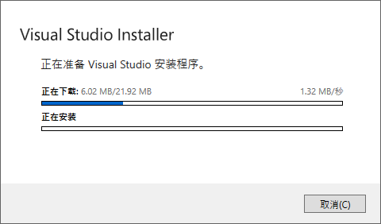
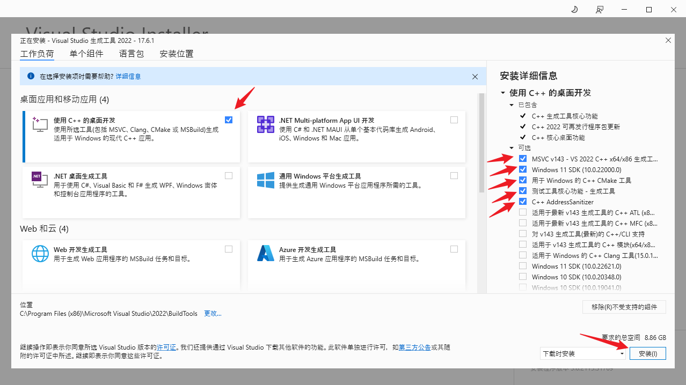

# DMR strategy demo
      

This is a project demo of the DMR strategy, which helps users to analyze the performance of a universal strategy based on the mean reversion assumption - the DMR strategy - compared to other universal strategies.

## Preparation

To run the demo properly, your computer needs to meet the following requirements:
- Python 3.8[important]: Please make sure you have [Python](https://www.python.org/downloads/) installed. The first recommendation is to use python 3.8, higher versions are theoretically possible.

- BuildTools[optional]: If your system is "Linux", you do not need to pay attention to this.

	If your computer system is windows, please run "vs_BuildTools.exe" in our project file to generate the underlying build code needed for "cxvopt" package in python. 

	The following screen may appear when you open it, please wait for the program to run automatically.

	

	Once successfully run, please check the appropriate boxes as shown below, then click "Install" in the bottom right corner and wait for it to finish.

	

	

## Introduction

### RunMe.py

You can run the python file to get the comparison and analysis results of all the strategies. Enter `python .\RunMe.py --help` in the console to get the usage instructions.
```powershell
DMRdemo> python .\RunMe.py --help
	
usage: RunMe.py [-h] [--r R] [--d D]
	
optional arguments:
	  -h, --help  show this help message and exit
	  --r R       result class: performance, heatmaps, heatmaps_alpha. for example: --r='performance' will calculate the
	              performance of the chased strategies.
	  --d D       dataset: run strategies in the dataset you select. default is 'all'.for example: --d='name' will run the
	              strategies in 'name.xlsx', --d='name1,name2' will run strategies in 'name1,xlsx' and 'name2.xlsx'.
	              Attention: the .xlsx files must in './data' folder before you run it!!
```

- `--r=[resultname]`: chose the result: "performance", "heatmaps", "heatmaps_alpha".  default is "performance".
	
	- `performance`: strategies performance, contains "total_wealth", "sharpe ratio", "information ratio", "alpha", "beta", "annualized_return", "annualized_volatility", "drawdown_period", "max_drawdown", "annual_turnover", "mean_excess_return", "calmar ratio", "run_time".
	
	- `heatmaps`: calculate the heat maps of DMR strategy in all the dataset.
	
	- `heatmaps_alpha`: calculate the heat maps of alpha_k of DMR strategy in all the dataset.
	
		for example: `--r="performance"` will calculate the performance of all the strategies. 
	
- `--d=[datasetname]`: run strategies in the dataset you select. default is 'all'.
	
	for example: `--d='name'` will run the strategies in 'name.xlsx', `--d='name1,name2'` will run strategies in 'name1,xlsx' and 'name2.xlsx'
	
	**Attention: the .xlsx file must be placed in the `./data` folder in advance!**

### data

This folder contains your dataset file, which must be an excel file in `.xlsx` format. The first row of the dataset file should be the stock name, and from the second row onwards, the stock closing price in ascending chronological order. for examples:

| date  | stock 1  | stock 2  | $\cdots$ | stock m  |
| -------- | -------- | -------- | -------- | -------- |
| day 1    | price 1  | price 1  | $\cdots$ | price 1  |
| day 2    | price 2  | price 2  | $\cdots$ | price 2  |
| $\vdots$ | $\vdots$ | $\vdots$ | $\vdots$ | $\vdots$ |

### result

This folder contains all kinds of results. If `performance` is selected when running `RunMe.py`, a `./result/performance` folder will be created to store the results. If `heatmaps` is selected, a `./result/heatmaps` folder will be created to store the results. If `heatmaps_alpha` is selected, a `./result/heatmaps_for_alpha` folder will be created to store the results.

## Quick Start

To ensure that you have all the third-party libraries required for your project installed in python, please run the following command before starting your project
```powershell
pip install -r requirements.txt
```

The following commands will help you to get started quickly with this project.

### Running 'performance' of strategies in dataset 'msci' and 'FS100' 

The following two commands have the same effect.
```powershell
python ./RunMe.py --r="performance" --d="msci,FS100"
```

or
```powershell
python ./RunMe.py --r="performance" --d="msci, FS100"
```

This command will run the performance results of all strategies on the msci dataset. The results are saved in the `./results/performance` folder.

### Running 'heatmaps' of DMR strategy in all the dataset

The following two commands have the same effect.
```powershell
python ./RunMe.py --r="heatmaps" --d='all'
```

or
```powershell
python ./RunMe.py --r="heatmaps"
```

This command will include a heat map of DMR strategy in all the datasets placed in the `./data` folder. The results are saved in `./result/heatmaps`.

### Running 'heatmaps_alpha' of DMR strategy in dataset 'msci'

```powershell
python ./RunMe.py --r="heatmaps_alpha" --d="msci"
```

This command will test the cumulative wealth of DMR strategies with different alpha_k on the 'msci' dataset. 

## Disclaimer

This software is only used for verification and exchange of learning purposes by editors and reviewers of EJOR. And it is far from any production environment. Do not risk money which you are afraid to lose. Use the software at your own risk. The authors assume no responsibility for your trading results.
